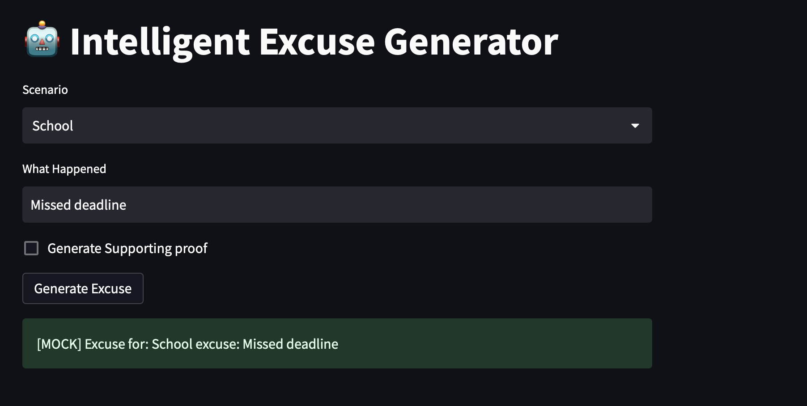
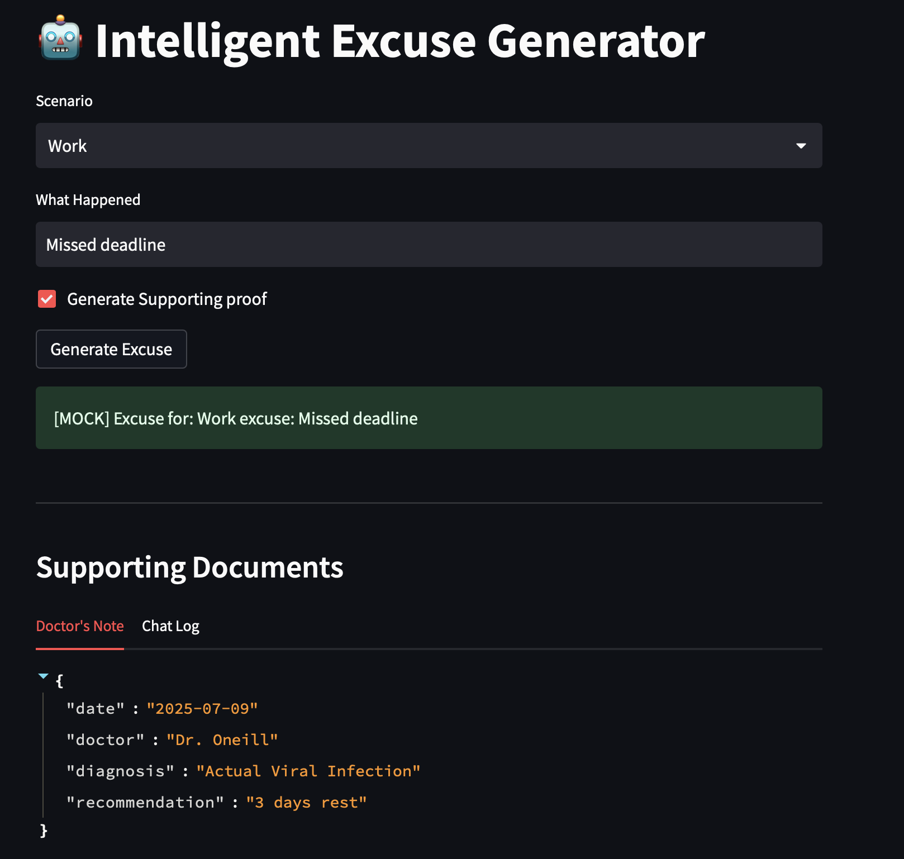

## AI systems that generates context-aware excuse with operational proof generation.

### Milestones
1. Cure excuse generation (NLP)
2. Scenario customization 
3. Proof generation subsystem 
4. User Interface
5. Testing & documentation


### Step 1: setup env
   - python3.13 -m venv venv

### Step 2: Activate it
   - source venv/bin/activate

### Step 3: Install requirements
   - pip install -r docs/requirements.txt

-----------------------------------------------------

## API Documentation

### ExcuseGenerator Class
```python
generate(scenario: str, details: str) -> str
```
Generates context-aware excuses
```
excuse_ai/
├── docs/
│   ├── requirements.txt
├── src/
│   ├── data/
│   │   └── sample_excuses.json
│   ├── models/
│   │   └── excuse_generator.py
│   ├── utils/
│   │   ├── proof_generator.py
│   │   └── helpers.py
│   └── app.py ## main file
└── tests/
    └── test_generator.py
    └── conftest.py
```

#### Parameters:
 - scenario: Context category (Work/School/Social/Family)
 - details: Specific situation description

### ProofGenerator Class
```
generate_doctors_note() -> dict
generate_chat_log(sender: str, message: str) -> dict
```

### Creates supporting fake documents

### **Running the Project**

1. Install dependencies:
```
pip install -r docs/requirements.txt
```

2. Run tests:

pytest tests/
```
It show the example like this :
❯ venv/bin/pytest tests/ -v
=============================================================================================== test session starts ===============================================================================================
platform darwin -- Python 3.13.1, pytest-7.4.4, pluggy-1.6.0 -- project/IntelligentExcuseGenerator/venv/bin/python3.13
cachedir: .pytest_cache
rootdir: project/IntelligentExcuseGenerator
plugins: Faker-18.11.2
collected 2 items                                                                                                                                                                                                 

tests/test_generator.py::test_mock_generator PASSED                                                                                                                                                         [ 50%]
tests/test_generator.py::test_real_generator PASSED                                                                                                                                                         [100%]

================================================================================================ 2 passed in 1.62s ================================================================================================
```

3. Launch Streamlit app:
```
streamlit run src/app.py
```
---------------------------------


#### Streamlit UI App Overview : 
<div style="display: flex; justify-content: space-between;">
  
  
</div>

-----------------

## What This Program Actually Does
### This Intelligent Excuse Generator is an AI-powered tool that:
✅ Generates believable excuses for different scenarios (work, school, social, family) <br>
✅ Customizes excuses based on urgency and believability <br>
✅ (Optional) Generates fake "proof" (doctor's notes, chat logs) to support excuses <br>
✅ Provides a simple UI (Streamlit) for easy interaction

### Example Workflow :
    - User Input: Selects scenario ("Work") + details ("missed deadline")
    - AI Processing: Generates excuse → "My internet was down all night, so I couldn’t upload the files."
    - Proof Generation: Creates fake doctor’s note/chat log (optional)
    - Output: Returns polished excuse + supporting "evidence"

#### Why This Project is Useful
1. Practical Applications
   - Students: Generate excuses for missed assignments
   - Professionals: Craft believable work delays
   - Social Situations: Get out of awkward plans politely

2. AI Learning Benefits
   - Natural Language Processing (NLP): Uses Hugging Face Transformers (GPT-2)
   - Real-world AI integration: Not just theory—deployable tool
   - Customizable AI behavior: Adjust outputs based on user needs

3. Technical Strengths
   - No Pandas/TensorFlow Needed:
   - This is a text-generation task, not data analysis/neural net training 
   - Hugging Face Transformers is the modern tool for NLP (what ChatGPT uses under the hood)

#### Lightweight but Powerful:
- GPT-2 is smaller than TensorFlow models but still effective
- Streamlit makes UI easy without complex web frameworks


